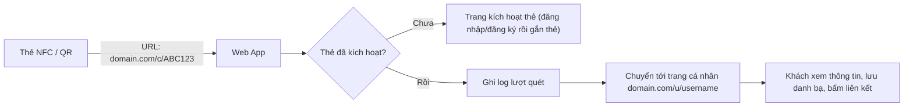
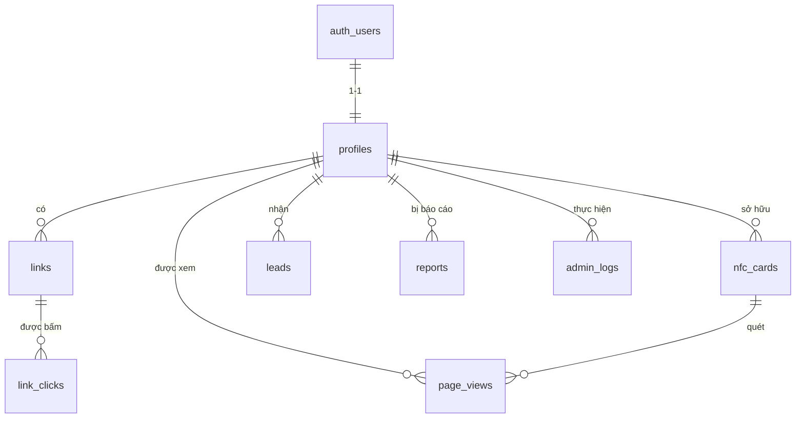

# 📇 TRANG CÁ NHÂN NFC — TÀI LIỆU ĐỀ XUẤT TÍNH NĂNG

> Phiên bản: 1.0 · Ngày tạo: 04/10/2026
> Mục tiêu: Khi ai đó quét thẻ NFC (hoặc mã QR) → mở ra trang thông tin cá nhân của chủ thẻ.
> Người dùng thật tự đăng ký, tự tạo trang. Admin quản lý toàn bộ hệ thống.
> Backend & lưu trữ: **Supabase** (Auth + PostgreSQL + Storage + Edge Functions).

---

## 1. Tổng quan hệ thống

### 1.1 Các vai trò (Roles)

| Vai trò | Mô tả |
|---|---|
| **Khách (Visitor)** | Người quét thẻ NFC/QR, xem trang cá nhân công khai, không cần đăng nhập |
| **Người dùng (User)** | Đăng ký tài khoản, tạo & chỉnh sửa trang cá nhân, quản lý thẻ của mình |
| **Admin** | Quản lý người dùng, thẻ NFC, nội dung, thống kê, cấu hình hệ thống |

### 1.2 Luồng hoạt động chính

> **Quan trọng:** Thẻ NFC chỉ nên chứa URL dạng **mã thẻ** (`/c/ABC123`) chứ không chứa trực tiếp username.
> Nhờ vậy người dùng có thể đổi username, đổi trang, hoặc admin khóa thẻ mà **không cần ghi lại thẻ**.

---

## 2. Tính năng cho KHÁCH (người quét thẻ)

### 2.1 Bắt buộc (MVP)
- [ ] Mở trang cá nhân ngay khi quét NFC / QR (tải nhanh < 2 giây trên 4G)
- [ ] Hiển thị: ảnh đại diện, ảnh bìa, họ tên, chức danh, công ty/trường, giới thiệu ngắn
- [ ] Nút liên hệ nhanh: **Gọi điện, Nhắn tin SMS, Email, Zalo, Messenger**
- [ ] Danh sách liên kết mạng xã hội: Facebook, TikTok, Instagram, YouTube, LinkedIn, GitHub, Website…
- [ ] Nút **"Lưu vào danh bạ"** (tải file `.vcf` vCard)
- [ ] Giao diện tối ưu mobile (mobile-first), responsive

### 2.2 Nâng cao
- [ ] Nút **"Chia sẻ trang"** (Web Share API) và hiển thị mã QR của trang
- [ ] Form **"Để lại thông tin của bạn"** (trao đổi liên hệ ngược lại với chủ thẻ)
- [ ] Hiển thị thông tin ngân hàng + mã **VietQR** để chuyển khoản nhanh
- [ ] Đa ngôn ngữ (Tiếng Việt / English)
- [ ] Chế độ sáng/tối
- [ ] Trang bảo vệ bằng mật khẩu (tùy chọn của chủ trang)

---

## 3. Tính năng cho NGƯỜI DÙNG

### 3.1 Tài khoản & Xác thực (Supabase Auth)
- [ ] Đăng ký bằng Email + mật khẩu (có xác minh email)
- [ ] Đăng nhập bằng **Google** (OAuth) — khuyến nghị
- [ ] Quên mật khẩu / đặt lại mật khẩu
- [ ] Đổi email, đổi mật khẩu
- [ ] Xóa tài khoản (tự xóa dữ liệu — tuân thủ quyền riêng tư)

### 3.2 Quản lý trang cá nhân
- [ ] Chọn **username** duy nhất → URL `domain.com/u/username`
- [ ] Chỉnh sửa thông tin cơ bản: tên, chức danh, đơn vị, bio, số điện thoại, email, địa chỉ
- [ ] Upload ảnh đại diện & ảnh bìa (Supabase Storage, tự nén/cắt ảnh)
- [ ] Thêm / sửa / xóa / **kéo-thả sắp xếp** các liên kết
- [ ] Bật/tắt hiển thị từng mục (ẩn số điện thoại, ẩn email…)
- [ ] **Xem trước (Preview)** trực tiếp khi chỉnh sửa
- [ ] Chọn **giao diện (theme)**: màu chủ đạo, font, kiểu nút, nền
- [ ] Bật/tắt trạng thái trang: Công khai / Riêng tư
- [ ] Thêm khối nội dung: văn bản, hình ảnh, video YouTube, bản đồ Google Maps, thông tin ngân hàng

### 3.3 Quản lý thẻ NFC
- [ ] **Kích hoạt thẻ**: quét thẻ mới → đăng nhập → thẻ tự gắn với tài khoản
- [ ] Hoặc nhập mã kích hoạt thủ công
- [ ] Xem danh sách thẻ mình sở hữu (1 người có thể có nhiều thẻ)
- [ ] **Báo mất / tạm khóa thẻ**
- [ ] Tải mã QR của trang (PNG/SVG) để in lên danh thiếp, sticker

### 3.4 Thống kê cá nhân
- [ ] Tổng số lượt xem trang, số lượt quét thẻ
- [ ] Biểu đồ lượt xem theo ngày / tuần / tháng
- [ ] Số lượt bấm vào từng liên kết
- [ ] Số lượt "Lưu danh bạ"
- [ ] Nguồn truy cập: NFC / QR / link trực tiếp; thiết bị (iOS/Android)

### 3.5 Danh bạ thu thập (Lead)
- [ ] Xem danh sách người đã để lại thông tin qua form
- [ ] Xuất danh sách ra Excel/CSV
- [ ] Nhận thông báo email khi có người để lại thông tin

---

## 4. Tính năng cho ADMIN

### 4.1 Dashboard tổng quan
- [ ] Tổng số người dùng, người dùng mới hôm nay/tuần/tháng
- [ ] Tổng số thẻ: đã cấp / đã kích hoạt / chưa kích hoạt / bị khóa
- [ ] Tổng lượt quét toàn hệ thống, biểu đồ tăng trưởng
- [ ] Top trang có lượt xem cao nhất

### 4.2 Quản lý người dùng
- [ ] Danh sách người dùng: tìm kiếm, lọc, phân trang, sắp xếp
- [ ] Xem chi tiết hồ sơ & trang của từng người
- [ ] **Khóa / mở khóa** tài khoản
- [ ] Chỉnh sửa / ẩn trang vi phạm
- [ ] Phân quyền: `user` / `admin` (có thể thêm `moderator`)
- [ ] Xóa người dùng
- [ ] Đặt lại mật khẩu cho người dùng (gửi email reset)

### 4.3 Quản lý thẻ NFC
- [ ] **Tạo hàng loạt mã thẻ** (ví dụ tạo 100 mã ngẫu nhiên) để ghi vào thẻ vật lý
- [ ] Xuất danh sách URL thẻ ra CSV để ghi NFC hàng loạt
- [ ] Gán thẻ thủ công cho người dùng / gỡ thẻ khỏi người dùng
- [ ] Khóa / mở khóa thẻ
- [ ] Xem lịch sử quét của từng thẻ
- [ ] Quản lý lô thẻ (batch), loại thẻ (thẻ nhựa, thẻ kim loại, sticker, móc khóa)

### 4.4 Kiểm duyệt nội dung
- [ ] Danh sách trang bị **báo cáo vi phạm** (khách có nút "Báo cáo")
- [ ] Danh sách username cấm (admin, root, support, từ ngữ nhạy cảm…)
- [ ] Ẩn trang, gửi cảnh báo cho người dùng

### 4.5 Cấu hình hệ thống
- [ ] Quản lý các theme / mẫu giao diện cho người dùng chọn
- [ ] Quản lý danh sách nền tảng mạng xã hội (icon, tên, định dạng URL)
- [ ] Bật/tắt cho phép đăng ký mới
- [ ] Gửi thông báo chung đến tất cả người dùng

### 4.6 Nhật ký hệ thống (Audit Log)
- [ ] Ghi lại mọi thao tác của admin (ai, làm gì, lúc nào, với đối tượng nào)

---

## 5. Thiết kế CSDL Supabase (đề xuất)

### 5.1 Bảng `profiles`
| Cột | Kiểu | Ghi chú |
|---|---|---|
| id | uuid (PK, FK → auth.users.id) | |
| username | text UNIQUE | chữ thường, 3–30 ký tự |
| full_name | text | |
| job_title | text | chức danh |
| organization | text | công ty / trường |
| bio | text | |
| phone | text | |
| email_public | text | email hiển thị công khai |
| address | text | |
| avatar_url | text | Storage |
| cover_url | text | Storage |
| theme | jsonb | màu, font, kiểu nút |
| bank_info | jsonb | ngân hàng, STK, tên chủ TK |
| visibility | jsonb | ẩn/hiện từng trường |
| is_public | boolean | default true |
| role | text | `user` / `admin` — default `user` |
| status | text | `active` / `banned` |
| created_at, updated_at | timestamptz | |

### 5.2 Bảng `links`
| Cột | Kiểu | Ghi chú |
|---|---|---|
| id | uuid PK | |
| profile_id | uuid FK → profiles | |
| platform | text | facebook, zalo, tiktok, website, custom… |
| title | text | |
| url | text | |
| position | int | thứ tự sắp xếp |
| is_active | boolean | |
| created_at | timestamptz | |

### 5.3 Bảng `nfc_cards`
| Cột | Kiểu | Ghi chú |
|---|---|---|
| id | uuid PK | |
| code | text UNIQUE | mã ngẫu nhiên 8–10 ký tự, ghi vào thẻ |
| profile_id | uuid FK (nullable) | null = chưa kích hoạt |
| batch_id | text | lô sản xuất |
| card_type | text | plastic, metal, sticker… |
| status | text | `unassigned` / `active` / `locked` / `lost` |
| activated_at | timestamptz | |
| created_at | timestamptz | |

### 5.4 Bảng `page_views` (thống kê)
| Cột | Kiểu | Ghi chú |
|---|---|---|
| id | bigint PK | |
| profile_id | uuid FK | |
| card_id | uuid FK (nullable) | nếu đến từ thẻ |
| source | text | `nfc` / `qr` / `direct` |
| user_agent | text | |
| device | text | ios / android / desktop |
| country, city | text | (tùy chọn) |
| created_at | timestamptz | |

### 5.5 Các bảng khác
- **`link_clicks`**: id, link_id, profile_id, created_at
- **`leads`**: id, profile_id, name, phone, email, note, created_at
- **`reports`**: id, profile_id, reason, reporter_email, status (`pending`/`resolved`), created_at
- **`reserved_usernames`**: username (PK)
- **`admin_logs`**: id, admin_id, action, target_type, target_id, details (jsonb), created_at

### 5.6 Supabase Storage
- Bucket `avatars` (public) — ảnh đại diện, giới hạn 2MB, chỉ jpg/png/webp
- Bucket `covers` (public) — ảnh bìa, giới hạn 5MB
- Đường dẫn: `{user_id}/avatar.webp` → policy chỉ cho chủ sở hữu ghi vào thư mục của mình

---

## 6. Bảo mật (Row Level Security — BẮT BUỘC)

> [!] Supabase lộ API công khai, nên **mọi bảng phải bật RLS**.

| Bảng | Khách (anon) | Người dùng | Admin |
|---|---|---|---|
| profiles | SELECT nếu `is_public = true` và `status = 'active'` | SELECT/UPDATE dòng của mình (không được sửa `role`, `status`) | Toàn quyền |
| links | SELECT link active của profile công khai | CRUD link của mình | Toàn quyền |
| nfc_cards | Không truy cập trực tiếp (qua function) | SELECT thẻ của mình | Toàn quyền |
| page_views / link_clicks | INSERT (qua function) | SELECT của mình | Toàn quyền |
| leads | INSERT | SELECT/DELETE của mình | Toàn quyền |
| reports | INSERT | — | Toàn quyền |
| admin_logs | — | — | SELECT/INSERT |

**Các điểm cần lưu ý:**
- Tạo hàm `is_admin()` (SECURITY DEFINER) để kiểm tra quyền admin trong policy.
- Dùng **trigger** tự tạo `profiles` khi có user mới trong `auth.users`.
- Chặn người dùng tự nâng `role` lên admin (trigger hoặc policy cột).
- Kích hoạt thẻ qua **RPC function** `activate_card(code)` để tránh chiếm thẻ người khác.
- Giới hạn tần suất (rate limit) form lead / báo cáo để chống spam (Edge Function + captcha như Cloudflare Turnstile).
- **Không bao giờ** đưa `service_role key` lên frontend.

---

## 7. Đề xuất công nghệ

| Thành phần | Lựa chọn đề xuất | Lý do |
|---|---|---|
| Frontend | **Next.js 14+ (App Router)** + TypeScript | SSR cho trang công khai → tải nhanh, SEO, preview link đẹp khi chia sẻ |
| UI | Tailwind CSS + shadcn/ui | Nhanh, đẹp, dễ tùy biến |
| Backend | **Supabase** (Auth, Postgres, Storage, Edge Functions) | Theo yêu cầu |
| Biểu đồ | Recharts | Thống kê dashboard |
| Kéo thả | dnd-kit | Sắp xếp liên kết |
| QR Code | `qrcode` / `qrcode.react` | Tạo mã QR |
| Form | React Hook Form + Zod | Validate dữ liệu |
| Deploy | **Vercel** (frontend) + Supabase Cloud | Miễn phí giai đoạn đầu |

### Cấu trúc URL đề xuất
| URL | Chức năng |
|---|---|
| `/` | Trang giới thiệu (landing page) |
| `/login`, `/register` | Đăng nhập / đăng ký |
| `/c/[code]` | Điểm vào từ thẻ NFC → xử lý & chuyển hướng |
| `/u/[username]` | Trang cá nhân công khai |
| `/dashboard` | Bảng điều khiển người dùng |
| `/dashboard/profile` | Chỉnh sửa trang |
| `/dashboard/links` | Quản lý liên kết |
| `/dashboard/cards` | Quản lý thẻ |
| `/dashboard/stats` | Thống kê |
| `/dashboard/leads` | Danh bạ thu thập |
| `/admin` | Dashboard admin |
| `/admin/users` | Quản lý người dùng |
| `/admin/cards` | Quản lý thẻ NFC |
| `/admin/reports` | Kiểm duyệt |
| `/admin/settings` | Cấu hình |
| `/admin/logs` | Nhật ký |

---

## 8. Lộ trình phát triển (Roadmap)

### 🟢 Giai đoạn 1 — MVP (2–3 tuần)
1. Khởi tạo dự án Next.js + kết nối Supabase
2. Tạo schema CSDL: `profiles`, `links`, `nfc_cards`, RLS, trigger
3. Đăng ký / đăng nhập (Email + Google)
4. Người dùng tạo & chỉnh sửa trang, upload ảnh, quản lý liên kết
5. Trang công khai `/u/[username]` + nút lưu danh bạ vCard
6. Route `/c/[code]` + kích hoạt thẻ
7. Admin: danh sách người dùng, khóa/mở, tạo mã thẻ hàng loạt
8. Deploy lên Vercel

### 🟡 Giai đoạn 2 — Hoàn thiện (2 tuần)
- Thống kê lượt xem / lượt quét / lượt bấm link
- Theme tùy chỉnh, preview trực tiếp
- Mã QR, chia sẻ trang
- Admin dashboard có biểu đồ, quản lý thẻ đầy đủ, audit log
- Báo cáo vi phạm & kiểm duyệt

### 🔵 Giai đoạn 3 — Mở rộng
- Form thu thập lead + thông báo email
- VietQR thông tin ngân hàng
- Đa ngôn ngữ
- PWA (cài như app trên điện thoại)
- Gói **Free / Pro** (thu phí theme cao cấp, thống kê nâng cao, tên miền riêng)
- Tài khoản **Doanh nghiệp/Tổ chức**: quản lý thẻ cho nhiều nhân viên/học sinh cùng lúc
- Thanh toán (VNPay / MoMo / PayOS)

---

## 9. Ghi chú về thẻ NFC
- Loại chip khuyến nghị: **NTAG213 / NTAG215 / NTAG216** (tương thích iPhone & Android).
- Nội dung ghi: một bản ghi **NDEF URL**: `https://domain.com/c/ABC123`
- Công cụ ghi thẻ: app **NFC Tools** (iOS/Android) — hỗ trợ ghi hàng loạt.
- Nên **khóa ghi (lock)** thẻ sau khi ghi để tránh bị người khác ghi đè.
- iPhone XS trở lên đọc NFC nền tự động; Android cần bật NFC.
- Luôn in kèm **mã QR** trên thẻ để dự phòng cho máy không có NFC.

---

## 10. Checklist trước khi chạy thật
- [ ] Bật RLS cho tất cả bảng, kiểm thử bằng tài khoản anon / user / admin
- [ ] Cấu hình SMTP riêng cho Supabase Auth (email xác minh không bị vào spam)
- [ ] Cấu hình Redirect URLs cho OAuth Google
- [ ] Thêm Chính sách bảo mật & Điều khoản sử dụng (dữ liệu cá nhân — Nghị định 13/2023/NĐ-CP)
- [ ] Sao lưu CSDL định kỳ
- [ ] Gắn tên miền riêng + HTTPS
- [ ] Tạo tài khoản admin đầu tiên (cập nhật `role = 'admin'` thủ công trong Supabase)

---

*Tài liệu này là tài liệu sống — cập nhật khi có thay đổi yêu cầu. Đánh dấu `[x]` vào các mục đã hoàn thành.*
