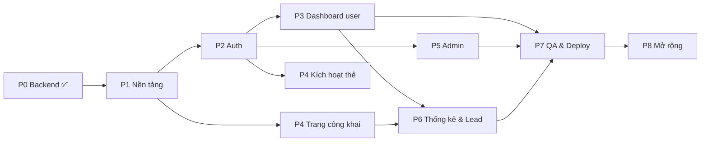

# 🗺️ ROADMAP — Lộ trình & Bảng điều phối dự án Trang Cá Nhân NFC

> **Nguồn sự thật duy nhất về tiến độ.** Mọi AI agent phải đọc [`AGENTS.md`](../AGENTS.md) trước, rồi nhận task ở đây.
> Điều phối viên: Antigravity (Coordinator) · Cập nhật lần cuối: 04/10/2026

**Chú thích trạng thái:** ⬜ TODO · 🟨 IN PROGRESS · ✅ DONE · 🟥 BLOCKED · 👤 Cần người dùng làm
**Nhãn:** `[DB]` có thay đổi database · `[UI]` giao diện · `[CORE]` nền tảng · `[SEC]` bảo mật

---

## 📊 Tổng quan tiến độ

| Giai đoạn | Tên | Trạng thái | Ghi chú |
|---|---|---|---|
| P0 | Backend Supabase | ✅ DONE | Schema, RLS, RPC, Storage đã áp dụng |
| P1 | Nền tảng Frontend | ✅ DONE | Next.js 15, Tailwind v4, shadcn, Supabase client, Landing page |
| P2 | Xác thực (Auth) | ✅ DONE | Email/Pass, Google OAuth, Reset Pass, Middleware, Onboarding |
| P3 | Dashboard người dùng | 🟨 IN PROGRESS | Đang thực hiện T3.1 |
| P4 | Trang công khai & NFC | ⬜ TODO | Cần P1 (một phần chạy song song P2/P3) |
| P5 | Khu vực Admin | ⬜ TODO | Cần P2 |
| P6 | Thống kê & Lead | ⬜ TODO | Cần P3, P4 |
| P7 | Kiểm thử & Triển khai | ⬜ TODO | Cần P3–P6 |
| P8 | Mở rộng | ⬜ TODO | Sau khi chạy thật |

## 🔀 Sơ đồ phụ thuộc

### Luồng làm song song (khi có nhiều agent)
Sau khi **P1 + P2 xong**, có thể chia 3 agent chạy song song, phạm vi file tách biệt:
- **Agent A — User:** P3 (`src/app/dashboard/**`, `src/components/dashboard/**`)
- **Agent B — Public:** P4 (`src/app/(public)/**`, `src/components/profile/**`)
- **Agent C — Admin:** P5 (`src/app/admin/**`, `src/components/admin/**`)

> File dùng chung (`src/lib/**`, `src/components/ui/**`, `middleware.ts`, `package.json`) — chỉ sửa khi task yêu cầu, và ghi rõ vào Nhật ký.

---

## ✅ P0 — Backend Supabase (HOÀN THÀNH)

| ID | Task | Trạng thái | Agent |
|---|---|---|---|
| T0.1 | Tạo project Supabase `trang-ca-nhan-nfc` (Singapore) | ✅ | Coordinator |
| T0.2 | `[DB]` Schema 11 bảng (migration 0001) | ✅ | Coordinator |
| T0.3 | `[DB]` Hàm RPC + trigger (0002), RLS (0003), Storage (0004), Seed (0005, 0006) | ✅ | Coordinator |
| T0.4 | Sinh `database.types.ts`, `.env.local`, tài liệu `SUPABASE_SETUP.md` | ✅ | Coordinator |
| T0.5 | 👤 Cấu hình Auth trên Dashboard: Site URL, Redirect URLs, bật Confirm email | ✅ | Người dùng · 05/10/2026 |
| T0.6 | 👤 Tạo Google OAuth Client & nhập vào Supabase (tùy chọn) | ✅ | Người dùng · 05/10/2026 |
| T0.7 | 👤 Cấu hình SMTP riêng (trước khi chạy thật) | ✅ | Người dùng · 05/10/2026 |

---

## P1 — Nền tảng Frontend

| ID | Task | Depends | Phạm vi | Trạng thái | Agent |
|---|---|---|---|---|---|
| T1.1 | `[CORE]` Khởi tạo Next.js 15 + TS + Tailwind v4 + ESLint (App Router, `src/`, alias `@/*`) tại thư mục gốc, **giữ nguyên** `docs/`, `supabase/`, `src/types/`, `.env*`, `AGENTS.md` | — | root | ✅ | Antigravity · 04/10/2026 |
| T1.2 | `[CORE]` Cài shadcn/ui + các component: button, input, label, card, dialog, dropdown-menu, form, avatar, badge, table, tabs, textarea, switch, select, sonner, skeleton, separator, sheet | T1.1 | `src/components/ui`, `components.json` | ✅ | Antigravity · 04/10/2026 |
| T1.3 | `[CORE]` Supabase client: `lib/supabase/client.ts`, `server.ts`, `middleware.ts` (dùng `@supabase/ssr`, kiểu `Database`) + `src/middleware.ts` refresh session | T1.1 | `src/lib/supabase`, `src/middleware.ts` | ✅ | Antigravity · 04/10/2026 |
| T1.4 | `[UI]` Root layout: font (Be Vietnam Pro), metadata, `<Toaster/>`, theme sáng/tối, trang 404 & error chung | T1.2 | `src/app/layout.tsx`, `not-found.tsx`, `error.tsx` | ✅ | Antigravity · 04/10/2026 |
| T1.5 | `[UI]` Landing page `/`: giới thiệu, cách hoạt động (3 bước), nút Đăng ký / Đăng nhập | T1.4 | `src/app/(public)/page.tsx` | ✅ | Antigravity · 04/10/2026 |

**Tiêu chí hoàn thành P1:** `npm run dev` chạy được, `npm run build` & `npm run lint` không lỗi; từ server component gọi được `supabase.from('social_platforms').select()` trả về 14 dòng.

---

## P2 — Xác thực (Auth)

| ID | Task | Depends | Phạm vi | Trạng thái | Agent |
|---|---|---|---|---|---|
| T2.1 | `[UI]` Trang `/register` & `/login` bằng Email + mật khẩu (zod validate, thông báo lỗi tiếng Việt, thông báo "kiểm tra email xác minh") | T1.3, T1.4 | `src/app/(auth)/**`, `src/actions/auth.ts` | ✅ | Antigravity · 04/10/2026 |
| T2.2 | `[CORE]` Route `/auth/callback` (exchange code) + nút "Đăng nhập với Google" | T2.1 | `src/app/auth/callback` | ✅ | Antigravity · 04/10/2026 |
| T2.3 | `[UI]` Quên mật khẩu `/forgot-password` & đặt lại `/reset-password` | T2.1 | `src/app/(auth)/**` | ✅ | Antigravity · 04/10/2026 |
| T2.4 | `[SEC]` Bảo vệ route: `/dashboard/**` cần đăng nhập; `/admin/**` cần `is_admin()`; user `status = banned` → đăng xuất + thông báo. Helper `getCurrentUser()`, `requireUser()`, `requireAdmin()` | T1.3 | `src/middleware.ts`, `src/lib/auth.ts` | ✅ | Antigravity · 04/10/2026 |
| T2.5 | `[UI]` Onboarding: user mới chưa có `username` → bắt buộc chọn username (kiểm tra realtime bằng RPC `is_username_available`) + nhập họ tên | T2.4 | `src/app/onboarding` | ✅ | Antigravity · 04/10/2026 |
| T2.6 | `[UI]` Nút đăng xuất + menu người dùng ở header | T2.1 | `src/components/user-menu.tsx` | ✅ | Antigravity · 04/10/2026 |

**Tiêu chí:** Đăng ký → xác minh email → đăng nhập → onboarding chọn username → vào `/dashboard`. User thường vào `/admin` bị chặn.

---

## P3 — Dashboard người dùng

| ID | Task | Depends | Phạm vi | Trạng thái | Agent |
|---|---|---|---|---|---|
| T3.1 | `[UI]` Layout dashboard: sidebar (desktop) / bottom-nav (mobile): Tổng quan, Trang của tôi, Liên kết, Thẻ NFC, Thống kê, Danh bạ, Cài đặt; nút "Xem trang của tôi" | T2.4 | `src/app/dashboard/layout.tsx` | ✅ | Antigravity · 05/10/2026 |
| T3.2 | `[UI]` `/dashboard/profile`: sửa thông tin (tên, chức danh, đơn vị, bio, SĐT, email công khai, địa chỉ, username), bật/tắt công khai, ẩn/hiện từng trường (`visibility`) | T3.1 | `dashboard/profile`, `actions/profile.ts` | ✅ | Antigravity · 05/10/2026 |
| T3.3 | `[UI]` Upload ảnh đại diện & ảnh bìa: cắt ảnh, nén sang webp phía client, lưu `{uid}/avatar-{ts}.webp` vào bucket, xóa ảnh cũ | T3.2 | `components/dashboard/image-upload.tsx` | ✅ | Antigravity · 05/10/2026 |
| T3.4 | `[UI]` `/dashboard/links`: thêm/sửa/xóa liên kết, chọn nền tảng từ `social_platforms`, bật/tắt, **kéo-thả sắp xếp** (cập nhật `position`) | T3.1 | `dashboard/links`, `actions/links.ts` | ✅ | Antigravity · 05/10/2026 |
| T3.5 | `[UI]` Tùy chỉnh giao diện (`theme` jsonb: màu chủ đạo, kiểu nút, nền) + **xem trước trực tiếp** khung điện thoại. Dùng chung component với P4 | T3.2, T4.1 | `dashboard/appearance` | ✅ | Antigravity · 05/10/2026 |
| T3.6 | `[UI]` `/dashboard/cards`: danh sách thẻ, form nhập mã kích hoạt (RPC `activate_card`), báo mất / mở lại (RPC `set_my_card_status`), tải mã QR trang | T3.1 | `dashboard/cards`, `actions/cards.ts` | ✅ | Antigravity · 05/10/2026 |
| T3.7 | `[UI][DB]` `/dashboard/settings`: đổi mật khẩu, đổi email, **xóa tài khoản** (cần migration RPC `delete_my_account()` security definer xóa `auth.users` của chính mình + ảnh trong storage) | T3.1 | `dashboard/settings`, migration mới | ✅ | Antigravity · 05/10/2026 |
| T3.8 | `[UI]` `/dashboard` tổng quan: thẻ tóm tắt (lượt xem hôm nay/7 ngày, số liên kết, số thẻ), checklist hoàn thiện hồ sơ | T3.1 | `dashboard/page.tsx` | ✅ | Antigravity · 05/10/2026 |

**Tiêu chí:** User tự hoàn thiện trang hoàn chỉnh, mọi thay đổi phản ánh ngay ở `/u/[username]`.

---

## P4 — Trang công khai & luồng NFC

| ID | Task | Depends | Phạm vi | Trạng thái | Agent |
|---|---|---|---|---|---|
| T4.1 | `[UI]` `/u/[username]`: Server Component, ảnh bìa, avatar, tên, chức danh, bio, nút liên hệ nhanh (Gọi, SMS, Email, Zalo), danh sách liên kết theo `position`, áp `theme`, tôn trọng `visibility`. Không tồn tại / riêng tư / bị khóa → trang 404 thân thiện | T1.3 | `(public)/u/[username]`, `components/profile/**` | ✅ | Antigravity · 05/10/2026 |
| T4.2 | `[UI]` Nút **"Lưu danh bạ"**: route `/u/[username]/vcard` trả file `.vcf` (vCard 3.0, UTF-8, kèm ảnh nếu có) | T4.1 | `(public)/u/[username]/vcard/route.ts` | ✅ | Antigravity · 05/10/2026 |
| T4.3 | `[CORE]` `/c/[code]`: gọi RPC `resolve_card` (truyền device, user_agent; `?src=qr` → source `qr`) → `active`: redirect `/u/{username}`; `unassigned`: sang T4.4; `locked`/`lost`/`not_found`/`profile_unavailable`: trang thông báo phù hợp | T1.3 | `(public)/c/[code]` | ✅ | Antigravity · 05/10/2026 |
| T4.4 | `[UI]` Trang kích hoạt thẻ mới: chưa đăng nhập → mời đăng nhập/đăng ký (giữ `?next=/c/{code}`); đã đăng nhập → nút "Gắn thẻ vào tài khoản" (RPC `activate_card`) | T4.3, T2.1 | `(public)/c/[code]/activate` | ✅ | Antigravity · 05/10/2026 |
| T4.5 | `[CORE]` Ghi thống kê: gọi `log_profile_view` khi truy cập trực tiếp (không ghi trùng khi đến từ `/c/`), `log_link_click` khi bấm liên kết (dùng `navigator.sendBeacon` hoặc route trung gian `/l/[linkId]`) | T4.1 | `components/profile/**` | ✅ | Antigravity · 05/10/2026 |
| T4.6 | `[UI]` Nút chia sẻ (Web Share API, fallback copy link) + hiển thị/tải mã QR của trang | T4.1 | `components/profile/share-*` | ✅ | Antigravity · 05/10/2026 |
| T4.7 | `[UI]` Nút "Báo cáo trang" → dialog nhập lý do → insert `reports` | T4.1 | `components/profile/report-dialog.tsx` | ✅ | Antigravity · 05/10/2026 |
| T4.8 | `[UI]` SEO & chia sẻ: `generateMetadata` (title, description, OG image = avatar), `robots` cho trang riêng tư | T4.1 | `(public)/u/[username]` | ✅ | Antigravity · 05/10/2026 |

**Tiêu chí:** Quét thẻ (mở `/c/{code}`) → tới trang cá nhân < 2 giây trên mobile; Lighthouse mobile ≥ 90.

---

## P5 — Khu vực Admin

| ID | Task | Depends | Phạm vi | Trạng thái | Agent |
|---|---|---|---|---|---|
| T5.1 | `[UI]` Layout `/admin` (sidebar: Tổng quan, Người dùng, Thẻ NFC, Báo cáo, Cài đặt, Nhật ký). Kiểm tra `requireAdmin()` ở layout server | T2.4 | `src/app/admin/layout.tsx` | ✅ DONE | Antigravity (05/10/2026) |
| T5.2 | `[UI]` `/admin` tổng quan: số liệu từ RPC `admin_get_overview`, biểu đồ người dùng mới & lượt quét 30 ngày (recharts), top 10 trang nhiều lượt xem | T5.1 | `admin/page.tsx` | ✅ DONE | Antigravity (05/10/2026) |
| T5.3 | `[UI]` `/admin/users`: bảng tìm kiếm/lọc/phân trang (server-side), xem chi tiết, khóa/mở (`status`), đổi `role`, ẩn trang (`is_public`), xóa user | T5.1 | `admin/users/**`, `actions/admin-users.ts` | ✅ DONE | Antigravity (05/10/2026) |
| T5.4 | `[UI]` `/admin/cards`: danh sách thẻ + lọc theo trạng thái/lô, **tạo hàng loạt** (RPC `admin_generate_cards`), **xuất CSV** (code, URL `{SITE_URL}/c/{code}`, batch), gán/gỡ thẻ cho user, khóa/mở thẻ, xem lịch sử quét | T5.1 | `admin/cards/**`, `actions/admin-cards.ts` | ✅ DONE | Antigravity (05/10/2026) |
| T5.5 | `[UI]` `/admin/reports`: danh sách báo cáo pending, xem trang bị báo cáo, xử lý (resolved/rejected) + tùy chọn ẩn trang / khóa user | T5.1 | `admin/reports/**`, `actions/admin-reports.ts` | ✅ DONE | Antigravity (05/10/2026) |
| T5.6 | `[UI]` `/admin/settings`: bật/tắt đăng ký (`site_settings`), thông báo chung, quản lý `social_platforms`, quản lý `reserved_usernames` | T5.1 | `admin/settings/**`, `actions/admin-settings.ts` | ✅ DONE | Antigravity (05/10/2026) |
| T5.7 | `[UI]` `/admin/logs`: xem `admin_logs` (lọc theo admin, hành động, ngày), xem chi tiết diff old/new | T5.1 | `admin/logs/**` | ✅ DONE | Antigravity (05/10/2026) |

**Tiêu chí:** Admin quản lý được toàn bộ user & thẻ; user thường không gọi được bất kỳ chức năng admin nào (kể cả gọi API trực tiếp).

---

## P6 — Thống kê & Lead

| T6.1 | `[DB]` Migration RPC thống kê: `get_my_stats(p_days int)` (lượt xem theo ngày, theo nguồn nfc/qr/direct, theo thiết bị, click theo link) và `admin_get_timeseries(p_days int)` | P3 | migration mới | ✅ DONE | Antigravity (06/10/2026) |
| T6.2 | `[UI]` `/dashboard/stats`: biểu đồ lượt xem, nguồn truy cập, thiết bị, top liên kết; chọn 7/30/90 ngày | T6.1 | `dashboard/stats` | ✅ DONE | Antigravity (06/10/2026) |
| T6.3 | `[UI]` Form "Để lại thông tin" trên trang công khai (bật/tắt trong `theme`/`visibility`) + chống spam (Honeypot trap) | T4.1 | `components/profile/lead-form.tsx` | ✅ DONE | Antigravity (06/10/2026) |
| T6.4 | `[UI]` `/dashboard/leads`: danh sách, xóa, xuất CSV UTF-8 | T6.3 | `dashboard/leads` | ✅ DONE | Antigravity (06/10/2026) |
| T6.5 | `[DB]` Edge Function gửi email báo có lead mới (Resend) | T6.3, T0.7 | `supabase/functions/**` | ✅ DONE | Antigravity (06/10/2026) |

---

## P7 — Kiểm thử & Triển khai

| ID | Task | Depends | Trạng thái | Agent |
|---|---|---|---|---|
| T7.1 | `[SEC]` Kiểm thử RLS bằng 3 vai trò (anon / user A vs user B / admin): user không đọc/sửa được dữ liệu người khác, không tự nâng role, không chiếm thẻ người khác. Ghi kết quả vào `docs/TEST_REPORT.md` | P3, P5 | ✅ DONE | Antigravity (06/10/2026) |
| T7.2 | `[SEC]` Chạy `get_advisors` (security + performance), xử lý cảnh báo mới | T7.1 | ✅ DONE | Antigravity (06/10/2026) |
| T7.3 | `[UI]` Trang `/privacy` & `/terms` (theo Nghị định 13/2023/NĐ-CP về dữ liệu cá nhân) | P1 | ✅ DONE | Antigravity (06/10/2026) |
| T7.4 | Kiểm thử E2E luồng chính (Playwright/Node): đăng ký → tạo trang → kích hoạt thẻ → quét thẻ → xem trang | P3, P4 | ✅ DONE | Antigravity (06/10/2026) |
| T7.5 | Deploy Vercel, cấu hình env, tên miền | T7.1 | 🟨 IN PROGRESS | Người dùng & Antigravity |
| T7.6 | 👤 Cập nhật Site URL / Redirect URLs / Google OAuth theo tên miền thật; tạo tài khoản admin đầu tiên | T7.5 | ⬜ | **Người dùng** |
| T7.7 | Ghi thử thẻ NFC thật (NTAG215) & kiểm tra trên iPhone + Android | T7.5 | ⬜ | **Người dùng** |

---

## P8 — Mở rộng (sau khi chạy thật)

| ID | Task | Ghi chú |
|---|---|---|
| T8.1 | Thông tin ngân hàng + mã VietQR trên trang công khai | dùng cột `bank_info` |
| T8.2 | Thêm khối nội dung: văn bản, ảnh, video YouTube, Google Maps | `[DB]` bảng `blocks` |
| T8.3 | Đa ngôn ngữ Việt / Anh | next-intl |
| T8.4 | PWA (cài như app) | |
| T8.5 | Trang được bảo vệ bằng mật khẩu | `[DB]` |
| T8.6 | Gói Free / Pro + thanh toán (PayOS / VNPay / MoMo) | `[DB]` |
| T8.7 | Tài khoản Tổ chức: quản lý thẻ cho nhiều nhân viên/học sinh | `[DB]` |

---

## 🚧 Vấn đề cần điều phối
> Agent ghi vấn đề / đề xuất thay đổi kiến trúc vào đây. Điều phối viên sẽ trả lời ngay bên dưới.

| Ngày | Agent | Task | Vấn đề / Đề xuất | Quyết định |
|---|---|---|---|---|
| — | — | — | (chưa có) | — |

---

## 📝 Nhật ký thay đổi
> Mỗi task xong thêm 1 dòng. Mới nhất ở trên cùng.

| Ngày | Agent | Task | Tóm tắt | File chính |
|---|---|---|---|---|
| 06/10/2026 | Antigravity | T7.4 | Viết script kiểm thử tự động E2E `scripts/test-e2e.ts` xác minh 10/10 kịch bản: username availability, resolve thẻ NFC, log page view, chặn quyền admin và chuẩn danh thiếp vCard 3.0 | `scripts/test-e2e.ts`, `package.json` |
| 06/10/2026 | Antigravity | T7.1–T7.3 | Hoàn thành kiểm thử bảo mật RLS, quét cố vấn Supabase Advisors, lập báo cáo `docs/TEST_REPORT.md`, và xây dựng 2 trang pháp lý `/privacy` & `/terms` theo Nghị định 13/2023/NĐ-CP | `docs/TEST_REPORT.md`, `src/app/(public)/privacy/page.tsx`, `src/app/(public)/terms/page.tsx` |
| 06/10/2026 | Antigravity | P6 (T6.1–T6.5) | Hoàn thành toàn bộ Phase P6 — Thống kê & Lead: RPC `get_my_stats` & `admin_get_timeseries`, trang `/dashboard/stats` với Recharts trực quan 7/30/90 ngày, form thu thập thông tin khách `LeadForm` trên profile công khai, trang `/dashboard/leads` tìm kiếm/xóa/xuất CSV UTF-8, và Edge Function `notify-new-lead` gửi email báo lead mới | `src/app/dashboard/stats/**`, `src/app/dashboard/leads/**`, `src/components/profile/lead-form.tsx`, `src/actions/leads.ts`, `supabase/functions/notify-new-lead/**` |
| 06/10/2026 | Antigravity | T6.1 | Viết migration `0008_stats_and_timeseries.sql`, áp dụng RPC `get_my_stats` và `admin_get_timeseries`, cập nhật database types và tài liệu setup | `supabase/migrations/0008_*`, `src/types/database.types.ts`, `docs/SUPABASE_SETUP.md` |
| 05/10/2026 | Antigravity | P5 (T5.1–T5.7) | Hoàn thành toàn bộ Phase P5 — Khu vực Admin: Layout bảo vệ quyền admin, tổng quan & biểu đồ recharts 30 ngày, quản lý người dùng, quản lý kho thẻ NFC & tạo hàng loạt/xuất CSV, duyệt báo cáo vi phạm, cài đặt hệ thống & MXH, nhật ký kiểm tra audit logs | `src/app/admin/**`, `src/components/admin/**`, `src/actions/admin-*.ts` |
| 05/10/2026 | Người dùng | T0.5–T0.7 | Cấu hình xong Auth URLs, Google OAuth Provider, và hoàn tất cài đặt SMTP | Supabase Dashboard |
| 05/10/2026 | Antigravity | P4-PRO | Nâng cấp toàn diện giao diện Profile công khai chuẩn Pro: Ambient Aura Glow, 3D Holographic NFC Card xoay lật tương tác, vệt sáng quét Shimmer Sweep, âm thanh phản hồi Web Audio API, thẻ chuyển khoản VietQR Napas 247 | `src/components/profile/**`, `src/app/globals.css`, `src/lib/sound.ts` |
| 05/10/2026 | Antigravity | P4 (T4.1–T4.8) | Hoàn thành toàn bộ Phase P4: Trang cá nhân `/u/[username]`, tải vCard 3.0, luồng quét thẻ `/c/[code]`, kích hoạt thẻ mới, tracking link `/l/[id]`, chia sẻ QR & báo cáo vi phạm | `src/app/(public)/**`, `src/components/profile/**` |
| 05/10/2026 | Antigravity | T3.8 | Xây dựng Dashboard Overview `/dashboard` hoàn chỉnh: số liệu thực tế lượt xem, liên kết, thẻ NFC và checklist tiến độ hoàn thiện hồ sơ | `src/app/dashboard/page.tsx` |
| 05/10/2026 | Antigravity | T3.7 | Xây dựng trang `/dashboard/settings` đổi mật khẩu, đổi email, xóa tài khoản vĩnh viễn và tạo migration `0007_delete_my_account.sql` | `src/app/dashboard/settings/*`, `src/components/dashboard/settings-form.tsx`, `src/actions/settings.ts`, `supabase/migrations/0007_*` |
| 05/10/2026 | Antigravity | T3.6 | Xây dựng trang `/dashboard/cards` quản lý thẻ NFC, kích hoạt thẻ (RPC `activate_card`), báo mất/mở lại (RPC `set_my_card_status`), QR Code HD & SVG với qrcode | `src/app/dashboard/cards/*`, `src/components/dashboard/cards-manager.tsx`, `src/actions/cards.ts` |
| 05/10/2026 | Antigravity | T3.5 | Xây dựng trang `/dashboard/appearance` tùy biến giao diện: presets, màu sắc, bo góc, kiểu nút, font, kèm Live Mobile Preview iPhone | `src/app/dashboard/appearance/*`, `src/components/dashboard/appearance-editor.tsx`, `src/components/profile/profile-preview-card.tsx` |
| 05/10/2026 | Antigravity | T3.4 | Xây dựng trang `/dashboard/links` kéo-thả sắp xếp với @dnd-kit, thêm nhanh theo platform, dialog tạo/sửa, switch ẩn/hiện | `src/app/dashboard/links/*`, `src/components/dashboard/links-manager.tsx`, `src/actions/links.ts` |
| 05/10/2026 | Antigravity | T3.2, T3.3 | Trang `/dashboard/profile` quản lý thông tin cá nhân, visibility switch, upload avatar/cover client-side canvas nén WebP | `src/app/dashboard/profile/*`, `src/components/dashboard/*`, `src/actions/profile.ts` |
| 05/10/2026 | Antigravity | T3.1 | Xây dựng Dashboard layout với desktop sidebar, mobile bottom-nav, header, drawer | `src/app/dashboard/layout.tsx`, `src/components/dashboard/*` |
| 04/10/2026 | Antigravity | T2.6 | Xây dựng dropdown component `UserMenu` với avatar, link hồ sơ, quản trị, đăng xuất | `src/components/user-menu.tsx` |
| 04/10/2026 | Antigravity | T2.5 | Xây dựng trang `/onboarding` bắt buộc nhập username & kiểm tra realtime với RPC `is_username_available` | `src/app/onboarding/*`, `src/components/onboarding-form.tsx`, `src/actions/onboarding.ts` |
| 04/10/2026 | Antigravity | T2.4 | Bảo vệ route `/dashboard`, `/admin`, `/onboarding` trong middleware, helpers `getCurrentUser`, `requireUser`, `requireAdmin` | `src/middleware.ts`, `src/lib/supabase/middleware.ts`, `src/lib/auth.ts` |
| 04/10/2026 | Antigravity | T2.3 | Tạo trang `/forgot-password` & `/reset-password` với Zod, server actions | `src/app/(auth)/forgot-password/*`, `reset-password/*` |
| 04/10/2026 | Antigravity | T2.2 | Thêm route `/auth/callback` xử lý PKCE exchange cho OAuth Google & email confirm | `src/app/auth/callback/route.ts` |
| 04/10/2026 | Antigravity | T2.1 | Tạo trang đăng ký / đăng nhập với Zod, server actions, Google OAuth UI | `src/app/(auth)/*`, `src/actions/auth.ts`, `src/lib/validations/auth.ts` |
| 04/10/2026 | Antigravity | T1.5 | Xây dựng Landing page giới thiệu, 3 bước hoạt động, mockup phone, CTA | `src/app/(public)/page.tsx`, `src/components/theme-toggle.tsx` |
| 04/10/2026 | Antigravity | T1.4 | Cấu hình Be Vietnam Pro font, SEO metadata, Toaster, theme provider, 404 & error | `src/app/layout.tsx`, `not-found.tsx`, `error.tsx` |
| 04/10/2026 | Antigravity | T1.3 | Cấu hình Supabase client (client, server, middleware) với @supabase/ssr và types | `src/lib/supabase/*`, `src/middleware.ts` |
| 04/10/2026 | Antigravity | T1.2 | Cài shadcn/ui + 18 components, lucide-react, sonner, react-hook-form, zod | `src/components/ui/*`, `components.json` |
| 04/10/2026 | Antigravity | T1.1 | Khởi tạo Next.js 15, TS, Tailwind v4, ESLint, App Router, build & lint sạch | `package.json`, `tsconfig.json`, `src/app/*` |
| 04/10/2026 | Coordinator | — | Tạo `AGENTS.md` & `ROADMAP.md` | `AGENTS.md`, `docs/ROADMAP.md` |
| 04/10/2026 | Coordinator | T0.1–T0.4 | Tạo project Supabase, schema, RLS, RPC, storage, seed, types | `supabase/migrations/*`, `src/types/database.types.ts` |
| 04/10/2026 | Coordinator | — | Viết tài liệu đề xuất tính năng | `docs/DE_XUAT_TINH_NANG.md` |
